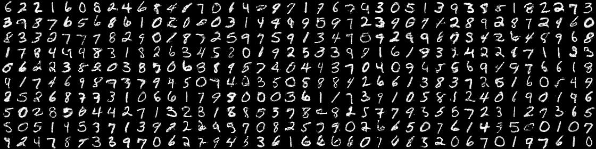
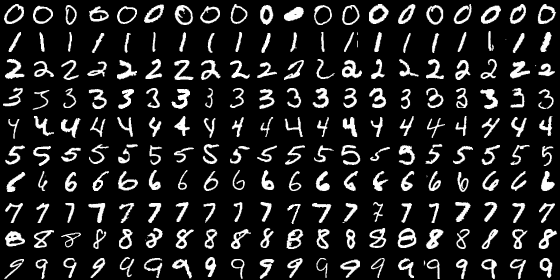
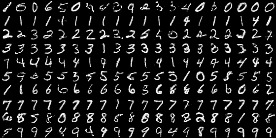

# Adversarial Feature Learning
[Jeff Donahue](http://jeffdonahue.com/), [Philipp Krähenbühl](http://www.philkr.net/), [Trevor Darrell](https://people.eecs.berkeley.edu/~trevor/)

This is the official code release for *Adversarial Feature Learning* ([arXiv](https://arxiv.org/abs/1605.09782)), including code to train and evaluate BiGANs — Bidirectional Generative Adversarial Networks — as well as the alternative GAN-based approaches to feature learning we evaluated.

The training code requires [Theano](https://github.com/Theano/Theano) and is based on the official [DCGAN](https://github.com/Newmu/dcgan_code) code from Alec Radford et al.

Please consider citing Adversarial Feature Learning if you use this code in your work:

    @article{donahue2016bigan,
      Author = {Donahue, Jeff and Kr\"ahenb\"uhl, Philipp and Darrell, Trevor},
      Journal = {arXiv preprint arXiv:1605.09782},
      Title = {Adversarial Feature Learning},
      Year = {2016}
    }

## Permutation-invariant MNIST

### Setup

Create a directory `./data/mnist` under the root of this repository.
This directory should contain the MNIST data files (or symlinks to them) with these names:

    t10k-images.idx3-ubyte
    t10k-labels.idx1-ubyte
    train-images.idx3-ubyte
    train-labels.idx1-ubyte

The `train_mnist.sh` script trains a "permutation-invariant" BiGAN (by default) on the MNIST dataset.
MNIST training takes about 30 minutes on a Titan X GPU (400 epochs at ~3.3 seconds per epoch).

### BiGAN
The BiGAN discriminator (or "joint discriminator") is enabled by setting a non-zero `joint_discrim_weight`.

    OBJECTIVE="--encode_gen_weight 1 --encode_weight 0 --discrim_weight 0 --joint_discrim_weight 1"
    ./train_mnist.sh $OBJECTIVE --exp_dir ./exp/perminv_mnist_u-50_bigan

This should produce output like:

      0) JD: 0.6932  E: 0.6932  G: 0.6932
    NND/100: 13.54  NND/10: 13.48  NND: 13.44  NNC_e: 91.50%  NNC_e-: 96.84%  CLS_e-: 91.39%  EGr: 13.64  EGr_b: 13.64  EGg: 3.00  EGg_b: 3.00
      1) JD: 0.4239  E: 1.2217  G: 1.2217
    NND/100: 7.37  NND/10: 7.26  NND: 7.19  NNC_e: 89.94%  NNC_e-: 92.56%  CLS_e-: 86.72%  EGr: 8.70  EGr_b: 9.55  EGg: 3.77  EGg_b: 5.84
     25) JD: 0.4490  E: 1.3910  G: 1.3910
    NND/100: 5.54  NND/10: 4.98  NND: 4.61  NNC_e: 95.41%  NNC_e-: 96.28%  CLS_e-: 91.33%  EGr: 7.29  EGr_b: 9.51  EGg: 5.24  EGg_b: 7.79
    200) JD: 0.1777  E: 2.8711  G: 2.8711
    NND/100: 5.56  NND/10: 4.83  NND: 4.33  NNC_e: 95.92%  NNC_e-: 97.14%  CLS_e-: 92.63%  EGr: 6.04  EGr_b: 9.91  EGg: 5.26  EGg_b: 9.58
    400) JD: 0.0545  E: 3.8253  G: 3.8253
    NND/100: 5.41  NND/10: 4.66  NND: 4.14  NNC_e: 92.10%  NNC_e-: 97.35%  CLS_e-: 79.48%  EGr: 5.95  EGr_b: 9.60  EGg: 5.20  EGg_b: 9.15

The first line of each output shows the loss (objective value) of each module -- in this case the joint discriminator (`JD`), encoder (`E`), and generator (`G`).
Here the encoder and generator losses are always equal, but this is not always the case (as in the latent regressor below).

The second line contains various measures of accuracy.

 * `NND*` measures generation quality (lower is better).
 * `NNC*` and `CLS*` measure "feature" quality by either a 1-nearest-neighbor (NNC) or logistic regression (CLS) classifier (higher is better).
   * `*_e` and `*_e-` denote the feature space, with `_e` being *E(x)* itself, and `_e-` being the layer of encoder features immediately before the output. (The latter normally works better.)
 * `EG*` measures reconstruction error (lower is better).
   * `EGr` is L2 error *|| x - G(E(x)) ||*, averaged across real data samples *x ~ p(x)*
   * `EGg` is also L2 error, but averaged across generated samples *x = G(z), z ~ p(z)*: *|| G(z) - G(E(G(z))) ||*
   * The corresponding `*_b` measures are "baselines", where the reconstruction error is computed against a *random* input, i.e. *|| x' - G(E(x)) ||* where *x* and *x'* are each random samples. The ratio `EGr / EGr_b` gives a more meaningful notion of reconstruction accuracy than `EGr` alone; e.g., if `EGr ~= EGr_b` as in epoch 0 above, no meaningful reconstruction is happening.

After training, the `samples` subdirectory of the directory specified in `--exp_dir` (in this case, `./exp/perminv_mnist_u-50_bigan/samples`) should contain generated samples and reconstructions.
`400.png` contains generated samples *G(z)* at the end of training (400 epochs):

`real.png` contains real data samples *x*:

`400.real_regen.png` contains corresponding reconstructions *G(E(x))*:

### Standard GAN with Latent Regressor (LR)
To train a standard GAN, set a non-zero `discrim_weight`.
To also learn a "latent regressor" encoder *E* by minimizing reconstruction error *L(z, E(G(z)))*, set a non-zero `encode_weight`.

    OBJECTIVE="--encode_gen_weight 0 --encode_weight 1 --discrim_weight 1 --joint_discrim_weight 0"
    ./train_mnist.sh $OBJECTIVE --exp_dir ./exp/perminv_mnist_u-50_latentreg

### Standard GAN with Joint Latent Regressor (Joint LR)
Finally, we can set a non-zero `encode_gen_weight` to jointly optimize the generator to both fool the discriminator and reconstruct *z* per the latent regressor loss.
(Here we set the weight to 0.25; a weight of 1 results in a degenerate solution.)

    OBJECTIVE="--encode_gen_weight 0.25 --encode_weight 1 --discrim_weight 1 --joint_discrim_weight 0"
    ./train_mnist.sh $OBJECTIVE --exp_dir ./exp/perminv_mnist_u-50_jointlatentreg

## ImageNet

### Setup

Create a directory `./data/imagenet` under the root of this repository.
This directory should contain:
 * `train.txt`
 * `train/`
 * `val.txt`
 * `val/`

The `*.txt` files are lists of labeled images as used in Caffe.
See the [Caffe ImageNet tutorial](http://caffe.berkeleyvision.org/gathered/examples/imagenet.html) (specifically the `get_ilsvrc_aux.sh` script) to download them, or prepare them yourself as follows.
`train.txt` lists image paths relative to `./data/imagenet/train` and integer labels (`val.txt` is analogous):

    n01440764/n01440764_10026.JPEG 0
    n01440764/n01440764_10027.JPEG 0
    n01440764/n01440764_10029.JPEG 0
    n01440764/n01440764_10040.JPEG 0
    [...]
    n15075141/n15075141_9933.JPEG 999
    n15075141/n15075141_9942.JPEG 999
    n15075141/n15075141_999.JPEG 999
    n15075141/n15075141_9993.JPEG 999

Relative to the root of this repository, the first image listed above should be located at `./data/imagenet/train/n01440764/n01440764_10026.JPEG`.

### Presized images for fast training (optional)

Using the raw high-resolution ImageNet images results in very slow training.
To speed this up, you can pre-resize the images to the training resolution using the included `resize_imageset.py` script.
(With a fast enough disk, e.g. an SSD, this should result in IO not being a bottleneck for training.)
The "standard BiGAN" experiments use images with a minor edge size of 72 (as shown below with `SIZE=72`);
the "generalized BiGAN" experiments use images with minor edge size of 128.

    SIZE=72  # or SIZE=128 for generalized BiGAN experiments
    # "-j 4" uses 4 resizing processes
    python resize_imageset.py -r -j 4 ${SIZE} ./data/imagenet ./data/imagenet${SIZE}

With an argument of `--raw_size 72` (for example), `train_gan.py` will automatically check if the presized image directory `./data/imagenet72` exists before falling back to `./data/imagenet`.

### BiGAN (72 pixel images)

`train_imagenet.sh` trains a BiGAN with *AlexNet*-style encoder on ImageNet images from the first 10 classes (labels 0-9).
This takes about 3 hours using a Titan X GPU: 400 epochs at ~24 seconds per epoch.
(Note that the first epoch may take much longer than 24 seconds due to compilation time.)

    OBJECTIVE="--encode_gen_weight 1 --encode_weight 0 --discrim_weight 0 --joint_discrim_weight 1"
    ./train_imagenet.sh $OBJECTIVE --exp_dir ./exp/imagenet_10_size72_u-200_bigan

You should see output like the following:

      0) JD: 0.6932  E: 0.6932  G: 0.6932
    NND/100: 54.81  NND/10: 53.49  NND: 52.74  NNC_e: 31.78%  NNC_e-: 35.97%  CLS_e-: 48.80%  EGr: 59.23  EGr_b: 59.26  EGg: 14.03  EGg_b: 13.94
      1) JD: 0.5664  E: 0.9069  G: 0.9069
    NND/100: 55.91  NND/10: 54.21  NND: 53.45  NNC_e: 19.26%  NNC_e-: 23.23%  CLS_e-: 37.91%  EGr: 65.22  EGr_b: 66.69  EGg: 38.27  EGg_b: 38.42
     25) JD: 0.6990  E: 0.7261  G: 0.7261
    NND/100: 42.16  NND/10: 39.78  NND: 37.99  NNC_e: 30.34%  NNC_e-: 31.55%  CLS_e-: 46.10%  EGr: 60.35  EGr_b: 75.33  EGg: 47.99  EGg_b: 62.76
    100) JD: 0.5405  E: 1.0896  G: 1.0896
    NND/100: 42.80  NND/10: 40.06  NND: 37.69  NNC_e: 34.67%  NNC_e-: 34.74%  CLS_e-: 51.80%  EGr: 65.58  EGr_b: 92.14  EGg: 64.16  EGg_b: 92.81
    200) JD: 0.5691  E: 1.0283  G: 1.0283
    NND/100: 42.11  NND/10: 39.13  NND: 36.93  NNC_e: 39.89%  NNC_e-: 42.55%  CLS_e-: 58.34%  EGr: 54.51  EGr_b: 79.90  EGg: 50.90  EGg_b: 78.35
    300) JD: 0.4585  E: 1.1793  G: 1.1793
    NND/100: 42.11  NND/10: 39.09  NND: 36.67  NNC_e: 34.31%  NNC_e-: 48.05%  CLS_e-: 58.40%  EGr: 50.84  EGr_b: 81.20  EGg: 47.38  EGg_b: 79.76
    400) JD: 0.4361  E: 1.2209  G: 1.2209
    NND/100: 41.96  NND/10: 38.97  NND: 36.57  NNC_e: 32.09%  NNC_e-: 48.54%  CLS_e-: 52.21%  EGr: 50.72  EGr_b: 80.74  EGg: 47.39  EGg_b: 79.31

For the (joint) latent regressor baselines, change the `OBJECTIVE=...` setting appropriately (see MNIST instructions above).

#### More data

For better results, train with 100 classes (`--max_labels 100`).
With more classes, each epoch takes proportionately longer,
so we suggest also training for fewer epochs and evaluating/saving more frequently:

    ./train_imagenet.sh $OBJECTIVE --exp_dir ./exp/imagenet_100_size72_u-200_bigan \
        --max_labels 100 --epochs 100 --decay_epochs 100 --disp_interval 5 --save_interval 10

In the paper, we train on the full dataset (`--max_labels 1000`) as follows:

    ./train_imagenet.sh $OBJECTIVE --exp_dir ./exp/imagenet_1000_size72_u-200_bigan \
        --max_labels 1000 --epochs 50 --decay_epochs 50 --disp_interval 1 --save_interval 5

### Generalized BiGAN (128 pixel images)

A "generalized BiGAN" can be trained with higher resolution images input to the encoder, while the generator output and discriminator input remain lower resolution.
The only difference is that we append the arguments `--raw_size 128 --crop_size 112 --crop_resize 64` specifying the larger encoder input size (see `train_imagenet_highres_encoder.sh`).
Due to the higher resolution encoder inputs, a single training epoch takes a bit longer: ~28 seconds on a Titan X (vs. ~24 seconds for a standard BiGAN).

    ./train_imagenet_highres_encoder.sh --exp_dir ./exp/imagenet_10_size128_resize64_u-200_bigan

You should see output like the following:

      0) JD: 0.6932  E: 0.6932  G: 0.6932
    NND/100: 55.33  NND/10: 53.66  NND: 52.97  NNC_e: 33.15%  NNC_e-: 34.10%  CLS_e-: 52.66%  EGr: 60.46  EGr_b: 61.04
      1) JD: 0.5973  E: 0.8482  G: 0.8482
    NND/100: 57.75  NND/10: 56.89  NND: 55.36  NNC_e: 29.67%  NNC_e-: 25.55%  CLS_e-: 41.33%  EGr: 71.01  EGr_b: 69.69
     25) JD: 0.5599  E: 0.9845  G: 0.9845
    NND/100: 44.48  NND/10: 41.47  NND: 39.31  NNC_e: 33.15%  NNC_e-: 35.50%  CLS_e-: 50.67%  EGr: 71.20  EGr_b: 88.41
    100) JD: 0.6725  E: 0.7844  G: 0.7844
    NND/100: 45.09  NND/10: 41.66  NND: 39.16  NNC_e: 36.93%  NNC_e-: 39.74%  CLS_e-: 56.34%  EGr: 58.49  EGr_b: 81.76
    200) JD: 0.5207  E: 1.1826  G: 1.1826
    NND/100: 44.22  NND/10: 40.68  NND: 38.06  NNC_e: 42.06%  NNC_e-: 39.54%  CLS_e-: 63.26%  EGr: 55.03  EGr_b: 80.23
    300) JD: 0.4100  E: 1.3064  G: 1.3064
    NND/100: 43.76  NND/10: 40.14  NND: 37.51  NNC_e: 33.76%  NNC_e-: 47.17%  CLS_e-: 63.29%  EGr: 52.96  EGr_b: 80.15
    400) JD: 0.3877  E: 1.3616  G: 1.3616
    NND/100: 43.77  NND/10: 40.08  NND: 37.46  NNC_e: 34.30%  NNC_e-: 48.60%  CLS_e-: 54.37%  EGr: 53.20  EGr_b: 80.37

(The latent regressor baselines aren't possible here, as those require the encoder input size be equal to the generator output size.
The `EGg` metrics are missing from the above output for the same reason.)

To train on more than 10 classes, see the additional arguments from the "More data" subsection above.

### Pretrained weights

You can download the pretrained BiGAN ImageNet weights used in the paper from [here](https://people.eecs.berkeley.edu/~jdonahue/pretrained_bigan_weights.zip) (zip file, 530 MB).
This file includes both the standard and generalized weights, with the raw NumPy weights saved by `train_gan.py`, as well as the converted and magic-init'ed caffemodels used for the PASCAL VOC feature learning experiments.
To download and install these weights at the locations assumed in `eval_model.sh` (see below), do the following from the root of this repository:

    mkdir -p exp
    pushd exp
    wget 'https://people.eecs.berkeley.edu/~jdonahue/pretrained_bigan_weights.zip'
    unzip pretrained_bigan_weights.zip
    rm pretrained_bigan_weights.zip  # optional
    popd

You can test that the weights work by "resuming" training at epoch 100 with the `--resume` flag:

    # standard BiGAN
    ./train_imagenet.sh --exp_dir ./exp/imagenet_1000_size72_u-200_bigan \
        --max_labels 1000 --epochs 50 --decay_epochs 50 --disp_interval 1 \
        --resume 100

    # generalized BiGAN
    ./train_imagenet_highres_encoder.sh --exp_dir ./exp/imagenet_1000_size128_resize64_u-200_bigan \
        --max_labels 1000 --epochs 50 --decay_epochs 50 --disp_interval 1 \
        --resume 100

This should perform a single evaluation and display roughly the following output:

    # standard BiGAN
    [...]
    Loading 26 params from: ./exp/imagenet_1000_size72_u-200_bigan/models/100_encode_params.jl
    Loading 28 params from: ./exp/imagenet_1000_size72_u-200_bigan/models/100_gen_params.jl
    Loading 23 params from: ./exp/imagenet_1000_size72_u-200_bigan/models/100_joint_discrim_params.jl
    Running 1000 deploy update iterations...done. (2198.155857 seconds)
    100) JD: 0.0003  E: 10.0109  G: 10.0109
    NND/100: 48.05  NND/10: 44.93  NND: 42.61  NNC_e: 2.30%  NNC_e-: 3.78%  CLS_e-: 9.39%  EGr: 64.98  EGr_b: 82.64  EGg: 63.28  EGg_b: 84.10
    Eval done. (144.725810 seconds)

    # generalized BiGAN
    [...]
    Loading 26 params from: ./exp/imagenet_1000_size128_resize64_u-200_bigan/models/100_encode_params.jl
    Loading 28 params from: ./exp/imagenet_1000_size128_resize64_u-200_bigan/models/100_gen_params.jl
    Loading 23 params from: ./exp/imagenet_1000_size128_resize64_u-200_bigan/models/100_joint_discrim_params.jl
    Running 1000 deploy update iterations...done. (2682.739910 seconds)
    100) JD: 0.0004  E: 9.7290  G: 9.7290
    NND/100: 50.76  NND/10: 46.44  NND: 43.74  NNC_e: 2.27%  NNC_e-: 3.84%  CLS_e-: 12.25%  EGr: 66.49  EGr_b: 81.08
    Eval done. (53.102715 seconds)

### Feature learning evaluation
After training a BiGAN (or other model) as shown above, it can be evaluated by transferring the encoder weights to auxiliary supervised learning tasks like classification and detection.
These evaluations (unfortunately) have several external dependencies:

  * [Caffe](https://github.com/BVLC/caffe)
    * for classification experiments, use philkr's "future" version of Caffe linked from voc-classification (see below)
    * for detection experiments, use rbgirshick's version of Caffe submoduled in Fast R-CNN (see below)
  * "Magic" (AKA data-dependent) initializations: [magic-init](https://github.com/jeffdonahue/magic_init) by [@philkr](https://github.com/philkr) (with a few modifications)
    * used for the random initializations of the fully connected layers fc6-8, and recalibration of the conv layer scales for more effective fine-tuning
  * Classification: [voc-classification](https://github.com/philkr/voc-classification) by [@philkr](https://github.com/philkr)
  * Detection: [Fast R-CNN](https://github.com/rbgirshick/fast-rcnn) by [@rbgirshick](https://github.com/rbgirshick)
  * Segmentation: [Fully Convolutional Networks](https://github.com/shelhamer/fcn.berkeleyvision.org) by [@shelhamer](https://github.com/shelhamer) and [@longjon](https://github.com/longjon)
  * PASCAL VOC dataset
    * [VOC 2007](http://host.robots.ox.ac.uk/pascal/VOC/voc2007/) for classification & detection
    * [VOC 2010](http://host.robots.ox.ac.uk/pascal/VOC/voc2010/) for segmentation

See `eval_model.sh` for an example of using `export_params.py`, magic-init, and voc-classification to run a full classification experiment.
(The included `export_params.py` converts the `numpy`/`joblib`-formatted BiGAN weights saved by `train_gan.py` to a `caffemodel` file.
`magic_init.py` uses magic-init to initialize the fully connected layer weights and rescales the convolution layers.
`train_cls.py` uses voc-classification to train the model for VOC classification and evaluate it.)

To run `eval_model.sh` yourself, follow these steps:

  1. Download and install Caffe, magic-init, and voc-classification.
  2. Modify the variables (`CAFFE_DIR`, `MAGIC_DIR`, `CLASS_DIR`) near the top of `eval_model.sh` specifying the paths where you installed these packages.
  3. Run `./eval_model.sh` (30-45 minutes on a Titan X). If you've downloaded the pretrained weights (see previous section), this should reproduce the `fc6` results from the paper (to within 1%), as shown below.  (The third of the four results, the 10-crop test set accuracy -- 52.8% -- is comparable to the 52.5% result from the paper).

    test        1 100%|##############################################################################|Time: 0:00:11
    0.425175004158    0.70 0.43 0.35 0.46 0.14 0.40 0.64 0.42 0.43 0.18 0.38 0.33 0.64 0.52 0.78 0.19 0.28 0.30 0.60 0.32
    train       1 100%|##############################################################################|Time: 0:00:11
    0.588507234158    0.80 0.58 0.63 0.68 0.33 0.53 0.75 0.63 0.57 0.48 0.51 0.45 0.67 0.64 0.83 0.38 0.57 0.52 0.68 0.53
    test       10 100%|##############################################################################|Time: 0:01:52
    0.528386346026    0.74 0.55 0.47 0.59 0.19 0.55 0.74 0.50 0.51 0.30 0.48 0.41 0.76 0.64 0.84 0.28 0.38 0.42 0.73 0.48
    train      10 100%|##############################################################################|Time: 0:01:54
    0.729344957115    0.90 0.75 0.82 0.81 0.48 0.74 0.84 0.73 0.68 0.64 0.69 0.55 0.81 0.82 0.89 0.51 0.67 0.69 0.87 0.68

  4. To reproduce the `conv1` or `fc8` results, do `TRAIN_FROM=conv1 ./eval_model.sh` or `TRAIN_FROM=fc8_cls ./eval_model.sh` instead.
